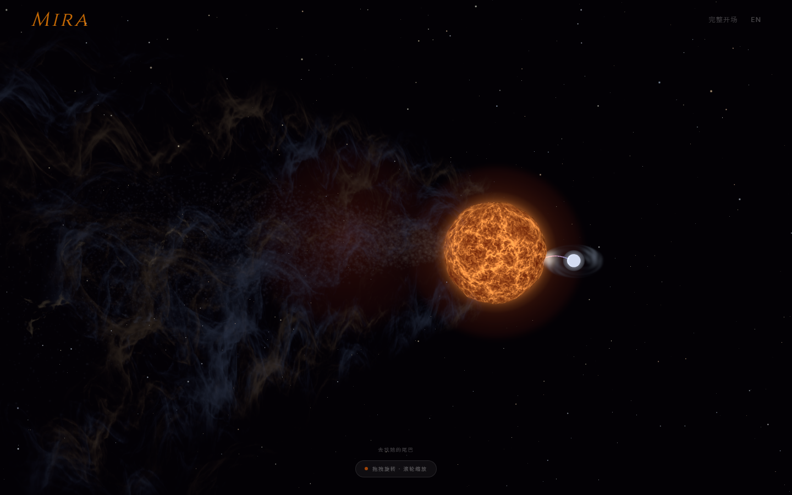
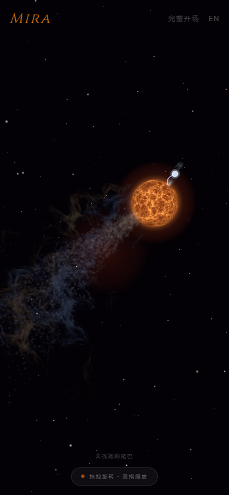
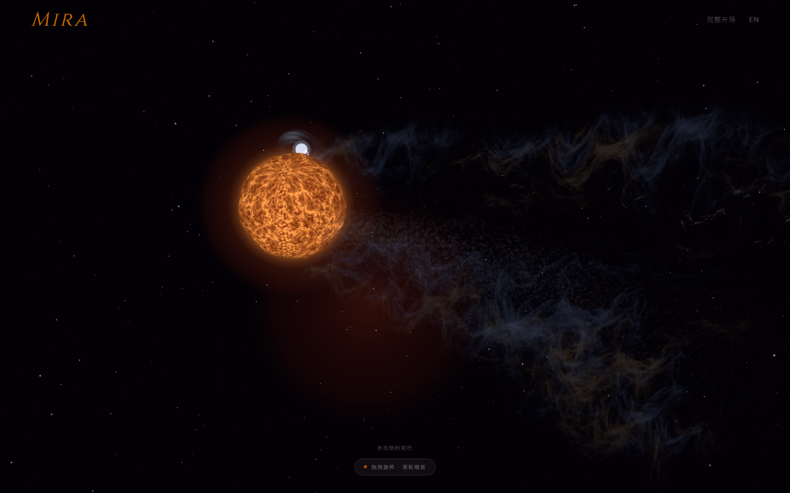

# Mira：前端与视觉打磨提案

2026-09-17 · 审阅本地 master `3320e00` · 提案，尚未实施

判断：技术栈适合，已有的美术能力也比一般网页背景特效深入。下一轮最大收益来自光河的明暗与空间层次、双星的共同材质语言、镜头交接和交互完成度。建议沿用 Wayfinder C「穿行体积」，先完成一张可信的实时主画面，再扩展动效。

## 本次证据与限制

- 读了 README、CONTEXT、当前视觉 SPEC、相关实现与历史接入记录。应用 frontend-design、emil-design-eng、webapp-testing 的审阅方法。
- 运行当前项目，捕获 1440×900、390×844、桌面旋转视角及两种信息卡；两种尺寸无横向溢出、无捕获到的 pageerror。
- 截图固定 `epoch=2026-09-17`，直达模式，启用 reduced-motion 便于观察构图；不代表完整开场的动态验收。星空背景仍有独立闪烁，截图尚不是完全确定性的像素基线。
- 浏览器使用 SwiftShader 软件渲染，桌面实挂 9 层、竖屏 5 层，DPR=1。不能据此宣布实际 GPU 或真机帧率、颜色呈现、发热与触控表现合格。
- `npm run build` 通过；主 JS 1,422.81 kB，gzip 441.03 kB。未在本次审阅重跑全套 E2E，也未验证线上部署是否与本地一致。
- 外部案例基于本次访问的官方案例介绍、页面内容和作者技术资料筛选，未声称完整游玩或测量其性能。
- [读数](evidence.json)；复现脚本：`experiments/design-audit-20260917.mjs`，依赖本地 5189 端口服务。

## 当前画面

对照目标仍是项目已有的 [去塑料感样张](../visual-direction/wayfinder/no-plastic-target-v1.png)。它是预渲染美术参考，不是当前网页效果，也不意味着实时场景必须逐像素复刻。

## 值得保留的部分

1. **方向成立。** 双星有明确的关系主题；界面基本让位于场景，避免了介绍站式的内容堆积。
2. **混合素材路线正确。** 灰度贴图提供细节，shader 控制颜色与变化，曲面提供视差；材质加载失败有程序化回退。这比直接贴一张宇宙壁纸更适合耐看与探索。
3. **直达模式与仪式时刻已分开。** 回访不必重看 15 秒完整开场；真实时间绑定也已经存在。
4. **竖屏确实重新构图。** 当前斜向尾巴和独立相机保留了双星，实测没有横向溢出，不是简单裁切宽屏。
5. **已有性能与可访问性意识。** 质量分档、DPR 上限、低档关闭 bloom、多个组件支持减少动态效果。应补齐缺口，而非推倒重做。

## 具体不足

### 美术判断

- **光河像暗色细丝，厚度不足。** 当前默认构图中，巨星是几乎唯一强视觉中心。光河有纹理却缺少连续的受光面、局部暗部遮挡和近景尺度差异。目标图的差距不能仅靠提高粒子数解决。
- **白矮星与巨星不在同一个质感体系。** 巨星已有复杂表面，白矮星仍像平滑白珠，吸积流有可读的完整圆环。物质流较像细线，关系连接不够有机。
- **自由旋转能暴露构图弱点。** 本次旋转视角中伴星被巨星部分遮挡、尾巴向另一侧展开。遮挡本身正常，但持续自动旋转会让观看者离开精心安排的主画面。保留自由旋转，同时增加回到主视角的轻量入口，主动操作后延迟恢复自动旋转。
- **安静不等于难读。** 9px 提示、低透明度按钮、极细字重共同削弱可发现性。底部常驻胶囊又有一点工具演示页的气质。
- **字体方案没有真正覆盖中文。** Cinzel/Inter/JetBrains Mono 的声明不能构成完整中文排版方案；结语声明 Caveat，但入口没有加载它。应明确中文标题、正文、结语各自的字体与回退，避免默认中文斜体模拟手写。

### 实现审阅：Before / After

| Before | After（建议） | Why |
|---|---|---|
| RiverVeil 使用每层固定 `uColor`，贴图主要控制 alpha；现有 pointLight 没有参与这段自定义 shader 的着色 | 将星体位置、距离衰减、密度梯度与方向性受光显式送入 shader，保留暗部 | 灯光对象的存在并不等于薄雾真的受光；这是体积感的重要缺口 |
| 高档 9 层共用一张密度图；提高层数时透明度又除以 count | 给近景雾、中景主体、细亮丝分配不同密度频率与独立权重 | 多叠几层不自动带来更厚、更亮、更可信的光河 |
| 高饱和巨星表面、较均匀的白矮星核心和同心弧 | 局部暗斑、不同尺度活动区、破碎弧、受来流影响的热斑 | 保留体积与层次，减少模型球和塑料圆环观感 |
| Canvas `onCreated` 就撤去 loading；开场以 `Date.now()` 启动 | 将主要素材就绪、程序化回退就绪、首个可呈现画面分别纳入进入条件 | 慢网下不会让仪式时刻先于主要画面发生；不能无限等失败贴图 |
| Scene 每帧更新 `cinematicTime` 到 Zustand，文字层直接订阅 | 连续时间留在 ref；只在字幕、标题阶段变化时发布状态 | 避免为了几次换字幕让 React 在开场逐帧更新；实际收益需 profiler 验证 |
| quality 只在启动时依赖屏幕、内存和 CPU 信息判档 | 以当前档起步，监测持续帧率，带上下阈值和冷却时间降 DPR / bloom / 层数 | 弱桌面 GPU 与设备发热无法靠启动信息判断；避免档位来回跳 |
| 部分时间推进检查 `document.hidden`，Canvas 仍是连续渲染 | 后台与静止状态显式管理渲染生命周期，恢复时不突然追赶时间 | 停止时间变化不等于停止绘制；不能让动态场景永久按需渲染而失去动画 |
| StarField 直接使用 `clock.elapsedTime`，没有 reduced-motion 分支 | 将背景闪烁纳入统一的减少动态效果策略 | 主要组件已经尊重偏好，背景还没有统一 |
| 实测按钮高度 13.5–16px；关闭按钮没有语义名称，range 没有关联 label | 保持文字小巧但扩展点击区到约 44px，增加名称、焦点样式与键盘入口 | 不必把视觉按钮做大，也能提高触控与键盘体验 |
| 实测 Esc 不关闭信息卡；信息卡淡入淡出各 0.5 秒 | Esc 关闭并正确管理焦点；进入约 180–240ms，退出约 120–180ms | 界面反馈应迅速，慢节奏留给镜头与天空 |
| 结语活动事件仅更新时间戳，每秒轮询一次；镜头在结语阶段禁用 controls | 第一次 pointerdown / wheel / keydown 即解除结语与镜头接管 | 观看者的第一次操作应该立即得到回应；这是代码推导，尚未实测最长延迟 |
| 无明确的应用级 WebGL 不可用或 context lost 展示路径 | 当前场景导出的静态后备画面、重试入口，处理 context lost/restored | 保留体验语气，避免黑屏；已存在的缺图回退仍保留 |

源文件入口：`Scene.tsx`、`RiverVeil.tsx`、`MiraA.tsx`、`MiraB.tsx`、`MaterialStream.tsx`、`StarField.tsx`、`InfoCards.tsx`、`ClosingMessage.tsx`、`CinematicOverlay.tsx`、`quality.ts`、`index.html`。

## 技术栈判断

**保留 React 19 + TypeScript + Vite + R3F/Three.js + Zustand + Motion + Tailwind。** 这套组合已经能完成提案核心。React 负责界面与离散状态，Three.js/shader 负责连续视觉。无需为美术升级迁到 Next.js、Unity 或另一套 WebGL 引擎。

- 已安装 Drei，`PerformanceMonitor` 可直接进入技术实验，不必再引入性能框架。
- Motion 足够处理信息卡、字幕、按钮反馈。相机继续由 R3F 更新；只有时间线编排复杂度确实上升，再评估 GSAP，不叠两套相机控制。
- 优先定位透明曲面 overdraw、后处理分辨率、GPU shader 和主线程更新成本；没有设备 profile 前不宣布哪个是瓶颈。
- 单主包约 1.42 MB 是值得处理的加载问题：先测冷启动，然后考虑先显示轻量界面/场景静帧，再异步启动 Scene。拆成几个 vendor 文件不会自动减少总下载量，也不能为了拆包延误直达模式。
- WebGPU、全场景 raymarching、GPGPU 大规模模拟属于后续研究候选。当前少量物质流粒子不值得为了数字漂亮而迁移到 GPGPU。

## 筛选后的参考

| 样本 | 经核实的内容 | 在 Mira 上的具体用法 | 取舍 |
|---|---|---|---|
| [Equinox / Little Workshop](https://www.littleworkshop.fr/projects/equinox/) · [体验](https://equinox.space/) | 作者说明使用 Three.js，结合视觉、声音、叙事和专门的触控交互 | 将完整开场按双星关系 → 连接 → 尾巴尺度安排；可选环境音随镜头距离变化 | 不引入生存任务、解谜、第一人称移动负担 |
| [Unseen Studio](https://unseen.co/) · [WebGL Rain](https://unseen.co/labs/webgl-rain/) | 页面提供拖动探索、声音选择；Rain 实验以按住减慢时间作为单一交互 | 让一次简单操作改变观看感受；交互提示使用一次后退场，声音主动开启 | 暂不添加与旋转冲突的长按手势；先做发现反馈和主视角恢复 |
| [Bruno Simon](https://bruno-simon.com/) | 当前官方页面公开质量、声音、脱困、移动端操作和实现来源 | 借鉴“探索后可恢复”的保障，提供回到双星主视角的轻入口 | 不借鉴车辆、积分、任务或完整控制面板；不因其使用 WebGPU 就迁移 |
| [Codrops：Dreamy Particles](https://tympanus.net/codrops/2024/12/19/crafting-a-dreamy-particle-effect-with-three-js-and-gpgpu/) | 作者讲解 GPGPU、交互粒子、shader 与后处理 | 后续可用于近景少量漂浮微尘、来流方向和速度变化的实验 | 微尘只是空间线索，不能替代光河主体，也不采用全屏跟鼠标逃散 |
| [Three.js volume cloud](https://threejs.org/examples/webgl_volume_cloud.html) | 官方体积云示例 | 对曲面仍无法解决的近景厚度做一个局部体积实验 | 先隔离试验，测 GPU 时间再决定是否接入；不直接全屏铺满 |

组件库筛选：

- [Drei PerformanceMonitor](https://github.com/pmndrs/drei/blob/master/docs/performances/performance-monitor.mdx)：直接复用的首选，已有依赖。内置上下阈值与回退机制，但仍需项目定义正确的采样和切档策略。
- [Motion accessibility](https://motion.dev/docs/react-accessibility)：复用已安装能力，统一自主运动和 UI 的 reduced-motion 规则。
- [Radix Dialog](https://www.radix-ui.com/primitives/docs/components/dialog)：可借鉴焦点、关闭、键盘语义。桌面信息卡是非模态场景说明，不应一律锁住焦点；移动卡若决定成为模态再使用对应语义。为一张简单卡新增库不是必需。
- [React Bits Galaxy](https://reactbits.dev/backgrounds/galaxy)：适合参考星点层次和光晕手法；[作者源码](https://github.com/DavidHDev/react-bits/blob/main/src/content/Backgrounds/Galaxy/Galaxy.jsx) 使用 OGL。不要把组件直接叠成第二个常驻 WebGL 背景；如有需要，提取思路到现有 StarField。
- 暂不引入通用整套 UI 皮肤。当前界面少，统一字体、间距、对比和触控范围的收益高于更换组件库。

技术依据：[R3F performance pitfalls](https://r3f.docs.pmnd.rs/advanced/pitfalls) 支持将高频更新留在渲染循环并避免不必要的 React 状态更新；[Drei useProgress](https://drei.docs.pmnd.rs/loaders/progress-use-progress) 可观察默认加载管理器，但不能单独证明首帧 shader 已编译并可见。

## Proposal A：把光河真正做成立体主角（首选）

**观看变化：** 双星在远处相伴，光河穿过中景，少量近景雾越过画面边缘；亮处有细节，暗处有厚度。默认画面即成立，拖动后空间关系仍成立。

**实施内容：**

1. 固定当前场景、日期与镜头，先做“密度权重 + 受光 + 色调输出”三个独立对照。星体部分 shader 已包含 tone mapping/color-space 输出，RiverVeil 没有相同代码路径；先检查实际 renderer/composer 链路，避免重复转换或误把颜色空间问题当成曝光问题。
2. 光河明确近、中、远三层职责。现有曲面优先；主雾负责体积、暗部负责间隔、稀疏亮丝负责方向。不先提高层数。
3. 如现有素材不能提供足够多尺度结构，再生成至多两类局部密度素材：大块柔雾和断续细丝。要求无星体、无封闭亮环、边缘可控、可平铺或明确使用边界。程序决定颜色、运动和位置。
4. 白矮星吸积流改为有断口、有明暗侧的弧，核心保留一点层次；巨星减少满表面同强度高频纹理。两星之间来流的宽度、亮度和着陆热斑形成连续关系。
5. 在三个自由旋转视角验证；不通过锁死相机掩盖问题。

**美术 token 起点：** 深空 `#07080F`、雾蓝 `#7185AD`、暮紫 `#807293`、珍珠金 `#DDC8A4`、恒星琥珀 `#EA8B45`、文字 `#EEE9DF`。这是方向样本，不是未经色彩链路校准即可直接替换全部 shader 的最终参数。

**字体与布局：** 保留 Mira 英文标识，中文短标题选有完整授权的宋体类字形、正文使用系统中文无衬线；结语不强制斜体。桌面让双星偏右、尾巴进入左前景；竖屏保持斜向但加强近处气流的尺度。辨识度集中在“共同前行的双星＋穿到眼前的光河”。

**投入预估：** 3–5 个开发日，含至少两轮美术比较；艺术探索可能扩大区间。预估不是排期承诺。

**验收：** 同镜头、同日期、同动画相位保存前后对比；中等屏幕亮度下光河方向清晰，核心没有大面积白片；近景有视差，旋转无矩形边缘/重复亮圈；桌面、竖屏、减少动态效果均由观看者确认。需要真实 GPU 设备性能记录。

## Proposal B：打磨成值得每天打开的网页（与 A 配套）

**观看变化：** 一打开就看到完整而安静的天空，控件找得到、点得到；信息卡来得快、退得快，结语不会抢走控制。

- 小字保持精致但提高对比；常用提示改为更易读的字号；隐藏的点击区域扩展到约 44px。
- 完整开场的 Skip 随语言切换；同步文档 lang；中文排版与英文各自定义。
- 信息卡补 Esc、关闭按钮名称、range label、键盘访问星体的途径。桌面保持非模态说明，避免覆盖主体。
- 第一次拖动后底部操作提示淡出；键盘聚焦或重新需要帮助时可找回。轻量回到主视角，不增加设置面板。
- 结语只在真正闲置时出现，正在读卡时不接管镜头；活动立即交还控制。暂停自主运动的能力与系统 reduced-motion 补齐。
- 首次加载、素材失败、WebGL 失败都保持同一视觉语气；场景导出的静帧仅用于加载/后备，不作为假装可交互的主场景。

**投入预估：** 1–2 个开发日。验收：键盘完整操作、Esc 恢复焦点、320/390/430px 与横屏不遮挡、慢网/缺图能进入有意义的画面、第一次活动即恢复操作。测试覆盖行为，另存视觉证据。

## Proposal C：让仪式时刻更有电影感（第二阶段）

**观看变化：** 镜头和声音共同揭示双星的关系，靠节奏建立震撼，而非不断增加闪光。

- 保留 15 秒可选完整开场及回访直达；将轨迹试验为一条有轻微弧度的路径，在尾巴展开前留短暂停顿。减少缩放与 FOV 同时大幅变化造成的廉价推拉感。
- 加一条自主开启的环境音：近处温暖低频、伴星的稀疏高音、远景宽阔底噪；切到后台淡出，禁声状态同样完整。素材先使用已授权或原创声音。
- 日期间的亮度、局部色温和细微密度变化共同表达“今晚不同”；保持确定性近似的真实时间绑定，不暗示获得了实时观测数据。
- 可试验一张“今晚的 Mira”静帧保存能力；仅在回访体验确实需要时再做，不用分享按钮占据主要画面。

**投入预估：** 2–4 个开发日，不含原创声音制作。先做短镜头实验再接入，A 未成立前不追加这一阶段。

## 建议顺序与完成标准

1. 固定当前截图、渲染相位和设备基线；立即补 B 的点击/键盘/结语控制问题。
2. 做 A 的单镜头实验：同一场景比较色彩链路、密度分工、受光。先复用现有素材；只有证据表明素材限制效果时再生图。
3. A 的方向获认可后合入完整开场、竖屏与自由旋转；加运行时自适应质量与加载恢复。
4. 真实桌面和选定手机跑 2 分钟静置、30 秒拖动、5 分钟连续观看；记录设备、浏览器、DPR/档位、帧时间分布和发热观察。桌面目标接近 60fps，手机目标持续约 30fps；这些是拟定目标，本次未测得。
5. 最后尝试 C；保存最终视觉对照、行为测试及设备记录。构建通过不能代替美术认可。

本轮推荐范围是 **A + B**。它们延续现有方向，也能直接解决当前画面与体验的短板。C 保留为后续提案。
